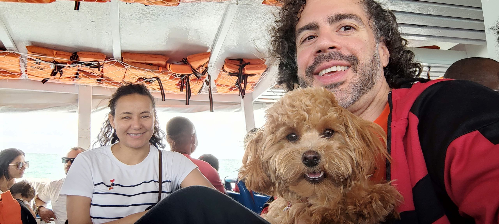
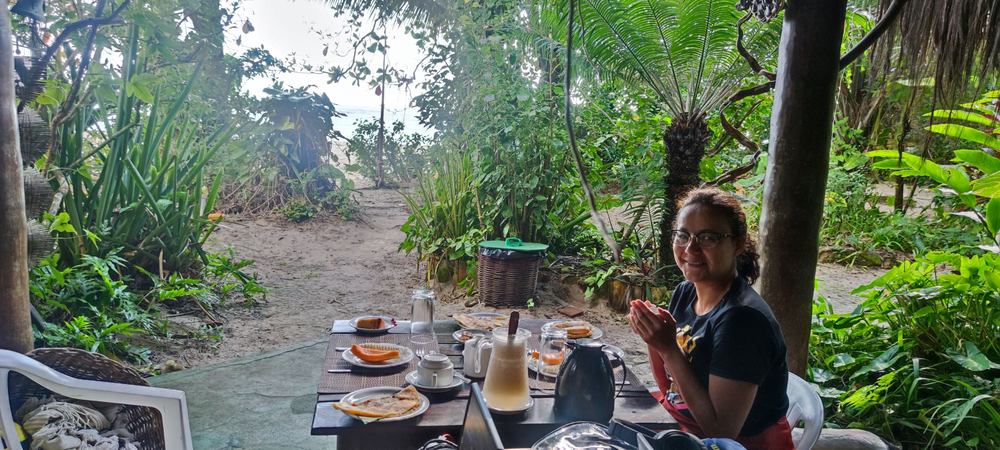
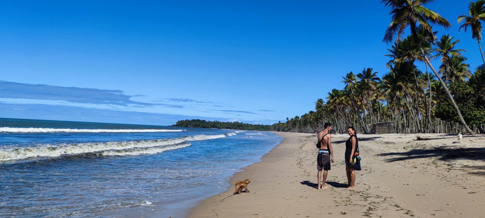
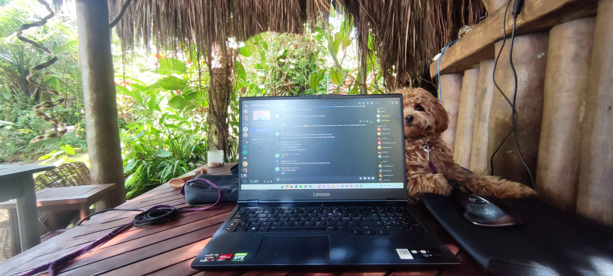
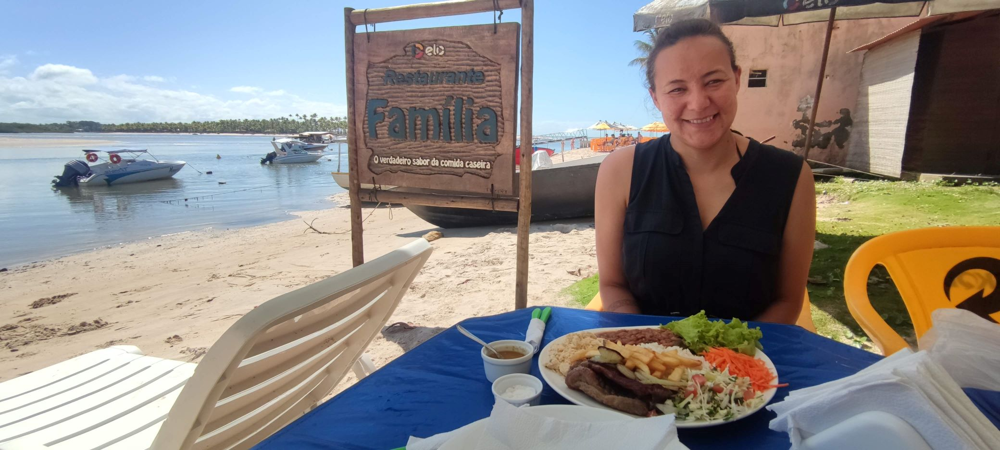

# Frequently Asked Questions

## Travel

### What are the visa requirements for visiting Brazil?

Visitors from Sweden and the USA do not need a visa for tourism purposes in Brazil. However, if you are coming from Vietnam, you may need to apply for a visa before your trip. Check with your embassy for more information.

### What is the best way to get to Boipeba Island?

The best way to get to Boipeba Island is to fly to Salvador, and then take a combination of bus and boat to the island. We will also be providing transportation from the Salvador airport on the 25th of October, 2024.

### Is it safe to travel in Brazil?

Like any country, there are certain precautions that travelers should take in Brazil. We recommend that you stay in well-lit areas, avoid carrying large sums of cash, and always be aware of your surroundings. Check with your embassy for the latest travel advisories.

### What is the local currency, and how can I exchange money?

The local currency in Brazil is the Brazilian real (BRL). You can exchange money at banks or currency exchange offices. Most establishments also accept major credit cards.

## Accommodation

### Where should I stay on the island?

We recommend staying near the beach of Velha Boipeba. Some recommended accommodations include Pousada Pouso da Maré, Pousada Marina de Boipeba, Pousada Mangabeiras, and Pousada Vila da Barra Boipeba.

### What are the accommodation options and their price ranges?

There are a variety of accommodations available on the island, including hotels, hostels, and vacation rentals. Prices range from budget-friendly to luxury. Check websites such as Booking.com or Airbnb for options.

### What amenities are available in the hotels/hostels?

Amenities vary by location, but many accommodations offer breakfast, Wi-Fi, and air conditioning.

## Climate

### What is the weather like in Brazil during October?

October is the start of the Brazilian spring, and temperatures are typically warm with occasional rain showers. The average temperature in Boipeba Island during this time is around 27°C (81°F).

### What should I pack for my trip?

We recommend packing comfortable clothing suitable for warm weather, sunscreen, insect repellent, and comfortable walking shoes.

## Language

### What languages are spoken in Brazil?

The official language of Brazil is Portuguese, but English and Spanish are also widely spoken, especially in tourist areas.

### Will I be able to get by with English, or should I learn some Portuguese?

While many people in Brazil speak English, it can still be helpful to learn some basic Portuguese phrases to make communicating with locals easier.

## Culture

### What are some cultural customs or etiquette that I should be aware of?

Brazilians are known for their warm hospitality, and it is customary to greet people with a handshake or kiss on the cheek. Tipping is also common in Brazil, especially in restaurants and for services such as haircuts or taxi rides.

### What are some must-try foods and drinks in Brazil?

Some popular Brazilian foods and drinks include feijoada (a stew made with black beans and meat), churrasco (Brazilian barbecue), caipirinhas (a cocktail made with cachaça, sugar, and lime), and brigadeiros (a type of chocolate truffle).

### What are some popular tourist attractions in Brazil?

Brazil is home to many beautiful beaches, historic cities, and natural wonders. Some popular tourist attractions include the Christ the Redeemer statue in Rio de Janeiro, and the Amazon rain forest.

---

## More

* [About the wedding](README.md)
* [About Boipeba](about_boipeba.md)
