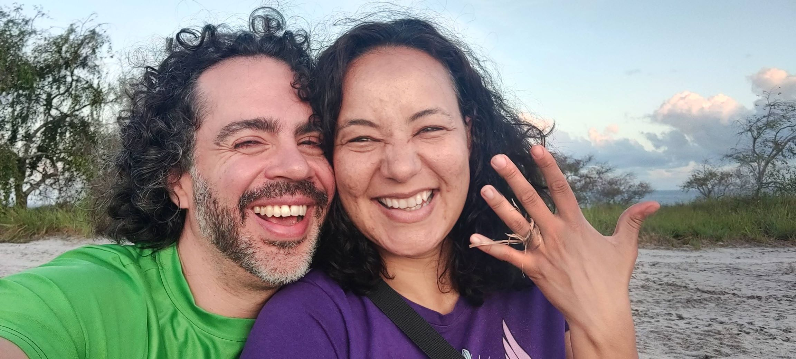

# October 2024 in Brazil

It's time to plan your vacations!

* **What?** Alice and JP are getting married! The wedding will be in Brazil.
* **When?** Next year, Friday 25 to Sunday 27 October 2024.
* **Who?** You, your partner, kids, parents, and pets! (We have a small dog)
* **Where?** The Island of [Boipeba, Brazil](https://goo.gl/maps/Gyozhw6E7Wx376dP8). Fly to [Salvador airport](https://goo.gl/maps/AFwTTmQ3w5ELiNnr8) and we'll get you transport to the island. The earlier you book the flight, the cheaper it is.
* **How?** RSVP as soon as you can: [click here](https://forms.gle/PB7Gt5JT76Uqiw656)

## Save the Date

Join us in beautiful Boipeba, Brazil on October 25-27, 2024 for our wedding celebration!

## About Us

Alice and JP met in Brazil in 2005 and after years of staying in touch, we decided to move in together. We got our dog Choco in 2021 and lived together in Lund, Sweden. We hope you can make it to our wedding as we take the next step in our lives together!

## Travel Information

The best way to get to Boipeba is to fly to Salvador. We'll provide transport from the airport on Friday, October 25th, 2024. If you're travelling from Sweden, you don't need a visa, but check with your embassy if you're travelling from another country. We can provide more details and guide you.

<iframe src="https://www.google.com/maps/embed?pb=!1m14!1m8!1m3!1d14842.75796451245!2d-38.932987384346916!3d-13.586292010823989!3m2!1i1024!2i768!4f13.1!3m3!1m2!1s0x73e61b88b1de1a5%3A0x5b5b68da70db5e03!2sPraia%20Boca%20da%20Barra!5e1!3m2!1sen!2sse!4v1681123068505!5m2!1sen!2sse" width="400" height="300" style="border:0;" allowfullscreen="" loading="lazy" referrerpolicy="no-referrer-when-downgrade"></iframe>

## Accommodation

Stay near the beaches of Velha Boipeba, on the north side. Around the beach [Boca da Barra](https://goo.gl/maps/tJuJ45CgrtzN98vB7) is good.

If you like "pousada" style there's [Pousada Pouso da Maré](https://goo.gl/maps/N3p6NQ7C7sP2BiC56) and [Pousada Marina de Boipeba](https://goo.gl/maps/h3ou3yWtppK3FgUU8) that we liked. The second is perfect if you plan to go kayaking or surfing. For an apartment with kitchen there's [Pousada Vila da Barra Boipeba](https://goo.gl/maps/hgGJsdCp73HNeRp56), and if you really want to live it up there's cozy houses at the top of the mountain, with an elevator, at [Pousada Mangabeiras](https://goo.gl/maps/Bh4mY6bEr8FXrpqA9).

## Schedule of Events

We'll have a more detailed schedule of events soon, but the wedding will be on Saturday with fun activities on Friday and Sunday.

## Registry

As we look forward to our future together, we would like to spend more time with each other in a happier environment, with fewer possessions. While we appreciate any gesture of generosity, we kindly request that you consider giving the gift of your presence instead of a physical gift. However, if you feel inclined to give, we would be grateful for a contribution to our honeymoon or a charity that is close to your heart. Above all, we value your presence at our wedding more than anything else.

## RSVP

Please RSVP at this link: [https://forms.gle/PB7Gt5JT76Uqiw656](https://forms.gle/PB7Gt5JT76Uqiw656)

Everyone in your family, including pets, are welcome at our wedding!

## Contact Information

You probably already have contact details for us, but you can always reach JP by email at seriema@gmail.com. Feel free to reach out with any questions or concerns you may have!
