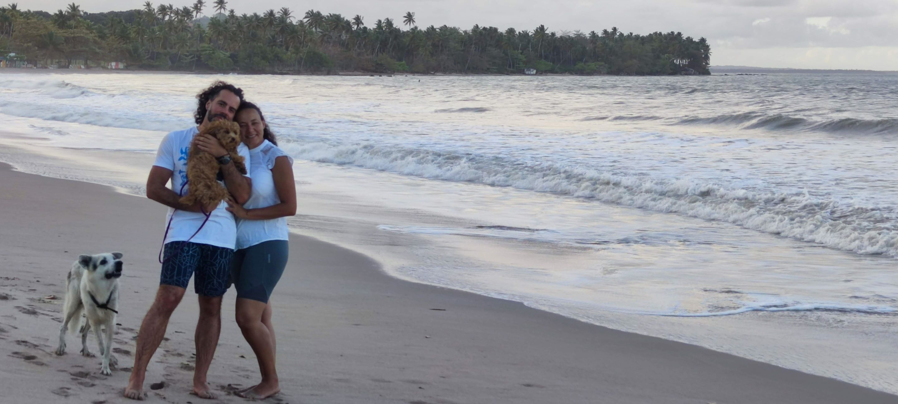

# For the curious

## About the island Boipeba

We spent a month here in August 2022. After two years in a city apartment during the pandemic, this was the perfect contrast for us.

The nature is protected and cars are not allowed. This means lots of nature, with few and low buildings.

Getting to the island is a bit complicated, and the inhabitants like it that way (and so do we). It means the island is very very safe. Bikes aren't locked and children play at night.

### Getting around

There's public transportation in the form of a tractor pulling a bus-like wagon, which we highly recommend. There's quadwheels driven by younger males trying to make a buck off tourists and they'll give you misinformation about the public transport (don't believe them). The bus is about R$ 10 and quads are R$ 40-60. We recommend the bus or walking as to not encourage practices that would turn the island into a tourist trap.

### Eating

Seafood is abundant as it's from the area. Red meats are more uncommon. Drinks, chocolate, and cocounuts are abundant.

### Exercise

There's a gym called [Boipeba Fitness](https://goo.gl/maps/PPJTtQqsn2MwvTTx8). There's also Capoeira, a traditional Brazilian dance/martial art (JP highly recommends you try it!), and also a judo dojo.

There's also plenty of surf and kayaking all around the island.

## Other cities to visit

Boipeba is a very calm and relaxed place. Very far away from the bustling beaches of Rio de Janeiro, both geographically and philosophically. This is how we prefer it, but if you're already in Brazil you might as well take in all the sights.

That said, you might enjoy [Salvador](https://goo.gl/maps/LvDTy5tyLkEC2b6k9), as that's where you'll land to and from the island, it might be worth a visit. [Rio de Janeiro](https://goo.gl/maps/k35Ho4341TNuYpqLA) is a classic beach vacation city with a lot of tourism, and [São Paulo](https://goo.gl/maps/bB9CaLBcejaA1oxU7) is a big metropolis (think New York instead of beaches).

There's an island right north of Boipeba called [Morro de São Paulo](https://goo.gl/maps/KG241Fdvn6Fk2UyH9) that is a touristy version of Boipeba.

---

## More

* [About the wedding](README.md)
* [Questions about travelling to Brazil](FAQ.md)
